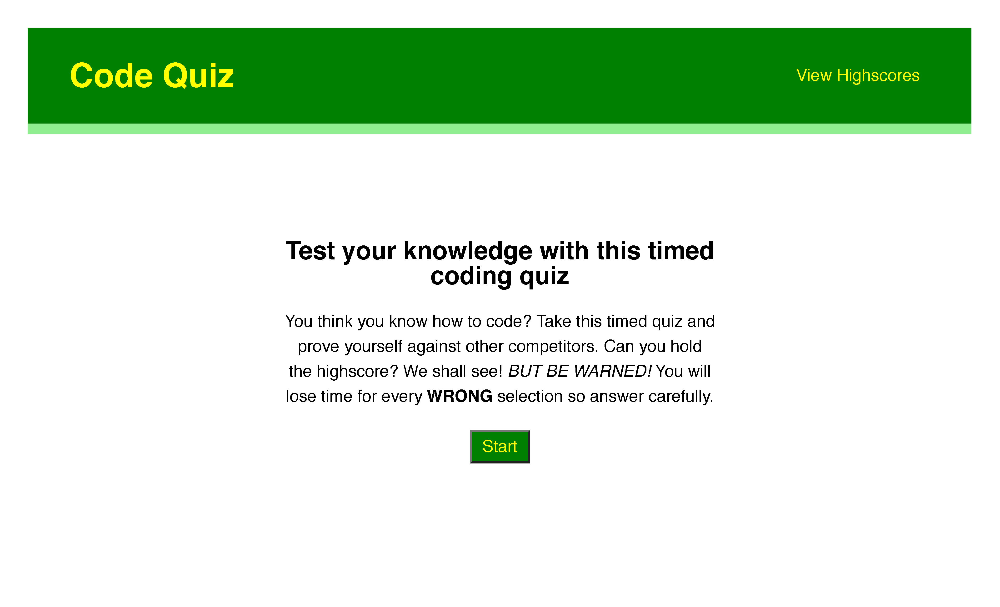

# Music-Quiz-Challenge4

## Description
This is the fourth challenge in the Northwestern Coding Bootcamp (Module 4). We, the students, were to create a timed coding multiple-choice quiz with multiple questions, where correct answers were tracked and incorrect answers reduced the time faster. We were also required to store scores and user initials in our local storage so when we refresh the scores page or visit it on another day, the scores and initials still render.

For the first time, we also created a relatively plain html file and dynamically created the text, buttons, etc on the page using javascript. This was, by far, the most challenging aspect of the project.

## Link to live page
[Live Link](https://mbronstein1.github.io/Code-Quiz/)

## Screenshot


## User Story

```
AS A coding boot camp student
I WANT to take a timed quiz on JavaScript fundamentals that stores high scores
SO THAT I can gauge my progress compared to my peers
```

## Acceptance Criteria

```
GIVEN I am taking a code quiz
WHEN I click the start button
THEN a timer starts and I am presented with a question
WHEN I answer a question
THEN I am presented with another question
WHEN I answer a question incorrectly
THEN time is subtracted from the clock
WHEN all questions are answered or the timer reaches 0
THEN the game is over
WHEN the game is over
THEN I can save my initials and my score
```